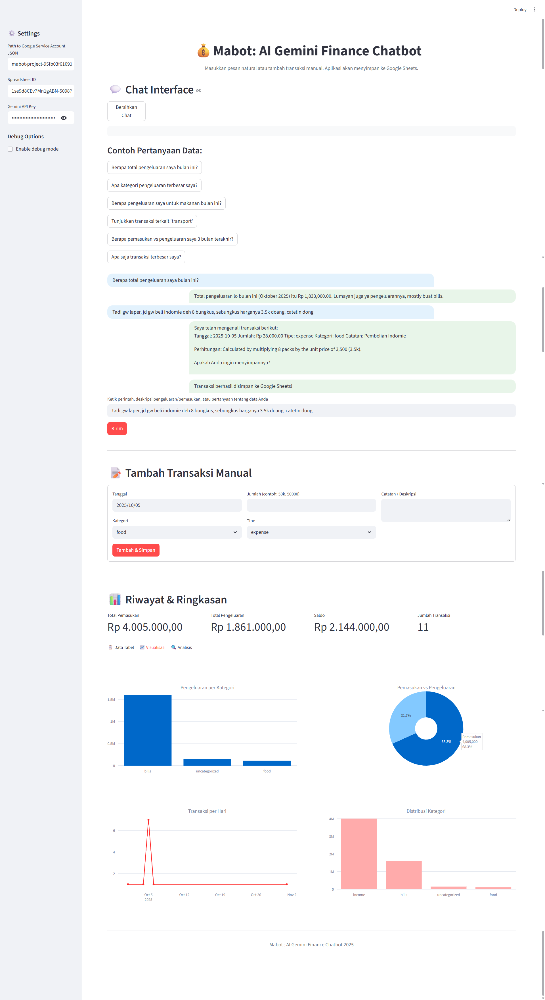

# AI Gemini Finance Chatbot

Aplikasi chatbot keuangan pribadi yang dibangun dengan Streamlit dan ditenagai oleh Google Gemini AI. Aplikasi ini memungkinkan Anda untuk mencatat transaksi keuangan dengan bahasa alami, menganalisis pengeluaran, dan menyimpan data ke Google Sheets.

## 🌟 Fitur Utama

- **Pencatatan Transaksi dengan Bahasa Alami**: Cukup ketik deskripsi transaksi seperti "Hari ini beli makan siang 50k" dan AI akan memahaminya
- **Analisis Data Keuangan**: Tanyakan tentang pengeluaran Anda seperti "Berapa total pengeluaran makanan bulan ini?"
- **Integrasi Google Sheets**: Semua data tersimpan secara otomatis di Google Sheets Anda
- **Visualisasi Data**: Grafik dan diagram untuk memahami pola pengeluaran Anda
- **Manajemen Transaksi**: Edit dan hapus transaksi yang sudah ada
- **Mode Debug**: Untuk pengembang yang ingin melihat log dan proses di balik layar

## 📸 Pratinjau



## 🚀 Instalasi dan Setup

### Prasyarat

- Python 3.9+
- Akun Google dengan Google Sheets
- API Key dari Google AI Studio (Gemini)

### Langkah 1: Clone Repository

```bash
git clone https://github.com/username/ai-gemini-finance-chatbot.git
cd ai-gemini-finance-chatbot
```

### Langkah 2: Instal Dependensi

```bash
pip install -r requirements.txt
```

### Langkah 3: Setup Google Service Account

1. Buka [Google Cloud Console](https://console.cloud.google.com/)
2. Buat project baru atau pilih project yang sudah ada
3. Aktifkan Google Sheets API dan Google Drive API
4. Buat Service Account:
   - Pergi ke "IAM & Admin" > "Service Accounts"
   - Klik "Create Service Account"
   - Isi nama dan deskripsi, lalu buat
5. Buat kunci JSON:
   - Klik pada Service Account yang baru dibuat
   - Pergi ke tab "Keys"
   - Klik "Add Key" > "Create new key"
   - Pilih "JSON" dan download
6. Bagikan Google Sheets Anda:
   - Buka spreadsheet yang ingin digunakan
   - Klik "Share" > "Advanced"
   - Tambahkan email Service Account dengan izin "Editor"

### Langkah 4: Setup Environment Variables

Buat file `.env` di root direktori proyek:

```
GOOGLE_SHEETS_JSON=/path/to/your/service-account.json
SPREADSHEET_ID=your_spreadsheet_id
SHEET_NAME = your_sheet_name
GEMINI_API_KEY=your_gemini_api_key
```

Untuk mendapatkan `SPREADSHEET_ID`:
- Buka Google Sheets Anda
- Tambahkan Header yang diperlukan
- Lihat URL, contoh: `https://docs.google.com/spreadsheets/d/1WJ75Y1uN2J1-fSXJ9v69FPSYS6CcgW20LjHjn-au10E/edit?usp=sharing`

Untuk mendapatkan `GEMINI_API_KEY`:
- Buka [Google AI Studio](https://makersuite.google.com/app/apikey)
- Buat API key baru atau Gunakan API key Anda

### Langkah 5: Jalankan Aplikasi

```bash
streamlit run streamlit-mabot-app.py
```

Aplikasi akan berjalan di `http://localhost:8501`

## 📖 Cara Penggunaan

### Menambah Transaksi

Ada dua cara untuk menambah transaksi:

1. **Chat Interface**: Ketik deskripsi transaksi dalam bahasa alami:
   - "Hari ini beli makan siang 50k"
   - "Kemarin bayar listrik 250.000"
   - "Gaji bulan ini 10 juta"

2. **Form Manual**: Gunakan form "Tambah Transaksi Manual" di bagian bawah

### Menganalisis Data

Gunakan chat interface untuk bertanya tentang data keuangan Anda:
- "Berapa total pengeluaran saya bulan ini?"
- "Apa kategori pengeluaran terbesar saya?"
- "Berapa pengeluaran saya untuk transport bulan ini?"
- "Tunjukkan transaksi terkait 'makanan'"

### Mengelola Transaksi

1. Pergi ke tab "Riwayat & Ringkasan"
2. Di tab "Data Tabel", pilih transaksi yang ingin diedit atau dihapus
3. Klik tombol "Edit" atau "Hapus"
4. Untuk edit, isi form yang muncul dan simpan perubahan

## 📁 Struktur Proyek

```
ai-gemini-finance-chatbot/
├── streamlit_app.py          # Aplikasi utama Streamlit
├── requirements.txt          # Dependensi Python
├── .env                      # Environment variables (jangan di-commit)
├── README.md                 # Dokumentasi proyek
├── finance_chatbot.log       # Log file (dibuat otomatis)
└── examples/
    ├── example_1.png
    ├── example_2.png
    └── example_3.png
```

## 🛠️ Dependensi Utama

- `streamlit`: Framework untuk aplikasi web
- `gspread`: Library untuk berinteraksi dengan Google Sheets
- `langchain-google-genai`: Integrasi LangChain dengan Google Gemini
- `pandas`: Manipulasi data
- `plotly`: Visualisasi data
- `python-dotenv`: Manajemen environment variables

## 🤝 Kontribusi

Kontribusi sangat diterima! Jika Anda ingin berkontribusi:

1. Fork repository ini
2. Buat branch fitur baru (`git checkout -b feature/AmazingFeature`)
3. Commit perubahan Anda (`git commit -m 'Add some AmazingFeature'`)
4. Push ke branch (`git push origin feature/AmazingFeature`)
5. Buka Pull Request

## 📝 Catatan Penting

- Pastikan file JSON Service Account disimpan dengan aman dan tidak di-commit ke repository
- API Key Gemini juga harus dirahasiakan
- Aplikasi ini menggunakan model Gemini 2.5 Flash yang mungkin memiliki batasan penggunaan
- Pastikan timezone di sistem Anda sudah benar untuk pencatatan tanggal yang akurat

## 🐞 Troubleshooting

### Masalah Koneksi Google Sheets

- Pastikan Google Sheets API dan Google Drive API sudah diaktifkan
- Pastikan Service Account memiliki izin "Editor" pada spreadsheet
- Periksa path ke file JSON Service Account

### Masalah Parsing Transaksi

- AI mungkin kesulitan dengan deskripsi yang terlalu ambigu
- Untuk transaksi dengan catatan kompleks, gunakan form manual
- Aktifkan mode debug untuk melihat proses parsing

### Masalah Visualisasi

- Pastikan data transaksi memiliki format tanggal yang benar
- Kosongkan cache browser jika grafik tidak muncul

## 📄 Lisensi

Proyek ini open source dan dapat digunakan oleh siapa saja selama tidak melanggar aturan dan etika.

## 🙏 Terima Kasih

- [Hacktiv8](https://www.hacktiv8.com/) untuk pelatihan dan sertifikasi AI tanpa biaya yang keren
- [kode.id](https://www.kode.id/) Maju Bareng AI Bersama Hacktiv8
- [Streamlit](https://streamlit.io/) untuk framework aplikasi web yang luar biasa
- [Google](https://ai.google.dev/) untuk Gemini API
- [LangChain](https://langchain.com/) untuk framework AI
- [Plotly](https://plotly.com/) untuk visualisasi data yang interaktif

## 📞 Kontak

Jika Anda memiliki pertanyaan atau masalah, silakan buka [issue](https://github.com/username/mabot-project/issues) di repository ini.